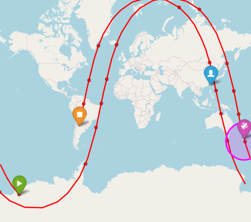
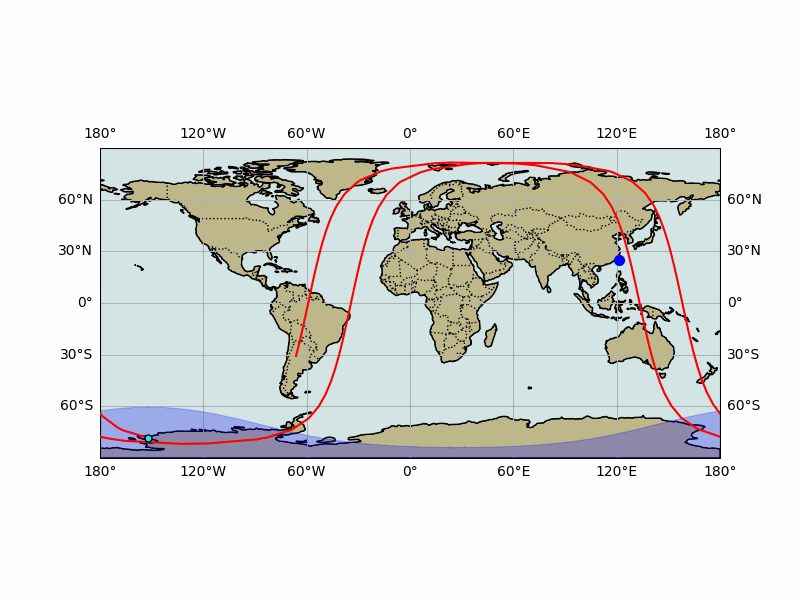

<p align="center">
  <a href="https://www.python.org/downloads/"></a>
  <a href="LICENSE"></a>
  <a href="https://huggingface.co/spaces/yachiashen/simple-ground-station">
  </a>
</p>

# Simple Ground Station 📡

> A lightweight **satellite ground station** web app built with **Gradio**.  
> - Fetch / load **TLE**  
> - Compute **real-time position** and **24h pass predictions**  
> - Generate **interactive Folium maps** (ground track & footprint)  
> - Export **footprint animation GIFs**

---

## Features

- **TLE source switching**: CelesTrak categories (Active, Weather, NOAA, GNSS, Starlink, …) or upload / paste TLE  
- **Real-time position**: Azimuth, elevation, range, subpoint, altitude  
- **Pass predictions**: Up to 24 hours, configurable min elevation  
- **Interactive map**: Folium with multiple basemaps, tracks, satellite markers, footprint circles  
- **Timeline slider**: Adjust display time interactively  
- **GIF animation**: Cartopy-based footprint GIF (custom duration, fps, timestep)  
- **Status log**: Clear logging of TLE fetching, caching, and map rendering  

---

## Visualization Examples

Example below shows **FORMOSAT-5 (福衛五號)** satellite visualization:  

<p align="center">
  
  
</p>

---

## Project Structure

```
simple-ground-station/
├─ data/                     # Downloaded TLE, GIF/HTML outputs
├─ src/
│  ├─ __init__.py
│  ├─ main.py                # Gradio UI entrypoint
│  ├─ tle_fetcher.py         # Fetch/manage TLE
│  ├─ satellite_tracker.py   # Skyfield calculations
│  └─ visualizer.py          # Folium/Cartopy visualization
├─ .gitignore
├─ LICENSE
├─ README.md
├─ README.zh-TW.md
└─ requirements.txt
```

---

## Prerequisites

- Python **3.10 ~ 3.13**  
  (tested with **Python 3.13.4** on macOS; earlier 3.10/3.11/3.12 should also work)  
- GEOS / PROJ system libraries (required for Cartopy)

**Install GEOS/PROJ:**  
- macOS:  
  ```bash
  brew install geos proj
  ```
- Ubuntu/Debian:  
  ```bash
  sudo apt-get update
  sudo apt-get install -y libgeos-dev proj-bin proj-data libproj-dev
  ```
- Windows: use Conda (recommended):  
  ```bash
  conda create -n sgs python=3.13
  conda activate sgs
  conda install -c conda-forge cartopy geos proj
  pip install -r requirements.txt
  ```

---

## Quick Start

```bash
# clone repo
git clone https://github.com/yachiashen/simple-ground-station.git
cd simple-ground-station

# (optional) create & activate a virtual environment
python -m venv venv

# macOS / Linux
source venv/bin/activate

# Windows (PowerShell)
.\venv\Scripts\Activate.ps1

# install dependencies
pip install -r requirements.txt

# run app
python -m src.main
```

> Gradio will print the access URL in your terminal
(e.g. http://127.0.0.1:7860 on your machine, or a temporary *.gradio.live link if enabled).

---

## Usage

1. Input **satellite name** (e.g., `ISS (ZARYA)` or `FORMOSAT`)  
2. Enter **observer coordinates** (e.g., Taipei `25.0330, 121.5654`)  
3. Choose **TLE source** (or upload / paste manually)  
4. Adjust **min elevation** and **map style**  
5. Click **Analyze** → position info, pass predictions, interactive map  
6. Use **timeline slider** to move forward/backward in time  
7. Generate **GIF animation** (custom duration, step, fps)

---

## TLE Sources

- [CelesTrak](https://celestrak.org/) groups (Active, Weather, NOAA, GOES, GPS/GLONASS/Galileo/BeiDou, Starlink…)
- Upload `.tle` file  
- Paste two-line TLE text  
- Falls back to cached local file if download fails

---

## Troubleshooting

- **`ModuleNotFoundError: No module named 'src'`**  
  → Use `python -m src.main` and ensure `src/__init__.py` exists  
- **Cartopy installation issues**  
  → Install GEOS/PROJ libraries, or use Conda  
- **Empty Folium map**  
  → Try switching basemap to OpenStreetMap / CartoDB  
- **GIF too slow/large**  
  → Increase `simulation_time_step_seconds` or reduce duration

---

## Notes

This project was developed during the course *"Introduction to Space Science and Engineering"* (NCKU, 2025) as part of my **final project**.  
It is **independent from class content** and was **entirely self-developed** (code, design, and documentation).

---

## License

[MIT License](LICENSE)

---

## Acknowledgements

- [Skyfield](https://rhodesmill.org/skyfield/) – precise astronomy library  
- [Cartopy](https://scitools.org.uk/cartopy/docs/latest/) – geospatial plotting  
- [Folium](https://python-visualization.github.io/folium/) – interactive Leaflet maps  
- [Gradio](https://www.gradio.app/) – web interface for ML/visual apps  
- TLE source: [CelesTrak](https://celestrak.org/)  
